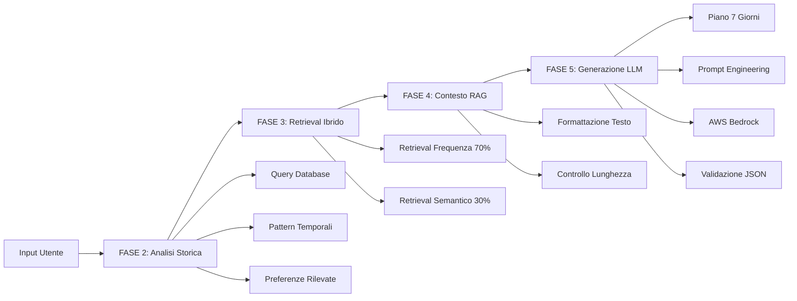

# 📖 Documentazione Completa - Progetto CFood

## 📁 Struttura Documentazione

```
docs/
├── README.md                           # Questo file - Panoramica generale
├── API_GENERA_PIANO.md                # Documentazione completa API
├── FASI_PROCESSO_DETTAGLIATE.md       # Dettagli tecnici implementazione
└── SETUP_GUIDE.md                     # Guida setup e configurazione
```

## 🎯 Panoramica Sistema

Il sistema **CFood Piano Alimentare** implementa una **pipeline RAG (Retrieval-Augmented Generation)** per generare piani alimentari personalizzati basati su:

- **Analisi storica** dei dati utente
- **Retrieval ibrido** (frequenza + similarità semantica)
- **Contesto RAG** strutturato per LLM
- **Generazione AI** tramite Claude 3.7 Sonnet

## 🏗️ Architettura Pipeline



## 📚 Guide Documentazione

### 🚀 Per Iniziare

**Leggi**: [`SETUP_GUIDE.md`](./SETUP_GUIDE.md)

- Prerequisiti sistema
- Configurazione AWS Bedrock
- Setup database PostgreSQL + pgvector
- Variabili d'ambiente
- Testing e troubleshooting

### 📡 Utilizzo API

**Leggi**: [`API_GENERA_PIANO.md`](./API_GENERA_PIANO.md)

- Endpoint documentation
- Request/Response examples
- Strutture dati complete
- Monitoring e performance
- Gestione errori

### 🔧 Dettagli Tecnici

**Leggi**: [`FASI_PROCESSO_DETTAGLIATE.md`](./FASI_PROCESSO_DETTAGLIATE.md)

- Implementazione ogni fase
- Query SQL dettagliate
- Algoritmi di scoring
- Prompt engineering
- Configurazioni avanzate

## ⚡ Quick Start

### 1. Setup Rapido

```bash
# Clone e install
git clone <repository>
cd cfood/app/cfood
pnpm install

# Configura .env.local
cp .env.example .env.local
# Modifica con le tue credenziali AWS e database

# Start development
pnpm dev
```

### 2. Test API

```bash
curl -X POST http://localhost:3000/api/genera-piano \
  -H "Content-Type: application/json" \
  -d '{
    "periodo_giorni": 30,
    "preferenze": ["pesce", "verdure"],
    "esclusioni": ["latticini"]
  }'
```

### 3. Response Attesa

```json
{
  "success": true,
  "fase_completata": "FASE_5_PIANO_GENERATO",
  "piano_alimentare": {
    "stato": "✅ Generato con successo",
    "piano_completo": {
      "durata_giorni": 7,
      "giorni": [
        /* 7 giorni di pasti completi */
      ]
    }
  }
}
```

## 🛠️ Stack Tecnologico

### Backend

- **Next.js 14** - Framework fullstack
- **TypeScript** - Type safety
- **Drizzle ORM** - Database queries
- **PostgreSQL + pgvector** - Database vettoriale

### AI & AWS

- **AWS Bedrock** - Platform LLM
- **Claude 3.7 Sonnet** - Generazione piano
- **Titan Embeddings V2** - Embedding semantici
- **pgvector** - Ricerca vettoriale

### DevTools

- **pnpm** - Package manager
- **ESLint + Prettier** - Code quality
- **Drizzle Kit** - Database migrations

## 📊 Metriche Performance

### Tempi Tipici (Production)

- **FASE 2** (Analisi Storica): ~800ms
- **FASE 3** (Retrieval Ibrido): ~1200ms
- **FASE 4** (Contesto RAG): ~100ms
- **FASE 5** (Generazione LLM): ~3000ms
- **TOTALE**: ~5-8 secondi

### Utilizzo Risorse

- **Token LLM**: 1000-1500 input, 2500-4000 output
- **Database Queries**: 5-8 query parallele
- **Memory**: ~50MB per richiesta
- **Response Size**: 15-25KB JSON

## 🔒 Sicurezza

### Environment Variables

```bash
# Credenziali sensibili in .env.local (non committare)
AWS_ACCESS_KEY_ID=***
AWS_SECRET_ACCESS_KEY=***
DATABASE_URL=postgresql://***
```

### Validazione Input

- Range `periodo_giorni`: 7-365
- Sanitizzazione array `preferenze`/`esclusioni`
- Rate limiting su endpoint (produzione)

### Database Security

- Connection pooling configurato
- SSL/TLS obbligatorio (produzione)
- Query parametrizzate (prevenzione SQL injection)

## 🐛 Debugging

### Logging Strutturato

```typescript
console.log("🤖 Chiamata Bedrock - Modello: claude-3-7-sonnet");
console.log("📝 Prompt: 3840 caratteri (960 token stimati)");
console.log("✅ Piano generato con successo in 4250ms");
```

### Health Checks

```bash
# Test connessione database
GET /api/health

# Response attesa:
{
  "status": "healthy",
  "services": {
    "database": "ok",
    "bedrock": "ok"
  }
}
```

## 🔄 Pipeline CI/CD

### Development Workflow

```bash
# Local development
pnpm dev              # Start con hot reload
pnpm test             # Run test suite
pnpm lint             # Code quality check
pnpm build            # Production build
```

### Database Migrations

```bash
pnpm drizzle-kit generate    # Genera migration
pnpm drizzle-kit migrate     # Applica migration
pnpm drizzle-kit studio     # Database explorer
```

## 📈 Monitoraggio

### Metriche Chiave

- **Success Rate**: Piani generati con successo / Richieste totali
- **Latency P95**: Tempo risposta 95° percentile
- **Token Usage**: Costi AWS Bedrock
- **Error Rate**: Errori per tipo (DB, AWS, validation)

### Alerts Raccomandati

- Latency > 10 secondi
- Error rate > 5%
- Database connection failures
- AWS Bedrock rate limiting

## 🔮 Roadmap Future

### Fase 6 - Validazione Nutrizionale

- [ ] Calcolo preciso macronutrienti
- [ ] Verifica bilanciamento giornaliero
- [ ] Suggerimenti correzioni automatiche

### Fase 7 - Salvataggio Database

- [ ] Persistenza piani generati
- [ ] Storico versioni
- [ ] Analytics utilizzo

### Fase 8 - Personalizzazione Avanzata

- [ ] Machine learning preferences
- [ ] Feedback loop qualità
- [ ] Integrazione wearables

### Ottimizzazioni

- [ ] Cache intelligent embeddings
- [ ] Response streaming
- [ ] Background job processing
- [ ] Multi-region deployment

## 🤝 Contributi

### Code Style

- **TypeScript strict mode** obbligatorio
- **ESLint** configurazione extended
- **Conventional Commits** per versioning
- **Test coverage** >80% per nuove feature

### Pull Request Process

1. Fork repository
2. Feature branch: `feature/descrizione`
3. Test completi locali
4. Pull request con descrizione dettagliata
5. Code review required
6. Merge dopo approvazione

## 📞 Supporto

### Documenti di Riferimento

- [API_GENERA_PIANO.md](./API_GENERA_PIANO.md) - API completa
- [SETUP_GUIDE.md](./SETUP_GUIDE.md) - Setup e troubleshooting
- [FASI_PROCESSO_DETTAGLIATE.md](./FASI_PROCESSO_DETTAGLIATE.md) - Implementation details

### Contatti Team

- **Backend**: Problemi database, AWS, API
- **AI/ML**: Tuning prompt, retrieval, embeddings
- **DevOps**: Deploy, monitoring, infrastructure

---

## 📋 Checklist Progetto

### ✅ Core Features Completate

- [x] **FASE 2**: Analisi storica completa
- [x] **FASE 3**: Retrieval ibrido funzionante
- [x] **FASE 4**: Contesto RAG ottimizzato
- [x] **FASE 5**: Generazione LLM stabile
- [x] **Documentazione**: Completa e dettagliata
- [x] **Testing**: Endpoint validato
- [x] **Error Handling**: Robusto e informativo

### 🔄 In Development

- [ ] **Performance tuning**: Caching layer
- [ ] **Monitoring**: Metrics dashboard
- [ ] **Health checks**: Automated testing

### 📅 Roadmap Q4 2025

- [ ] **FASE 6**: Validazione nutrizionale
- [ ] **FASE 7**: Persistenza database
- [ ] **UI Components**: Frontend integration
- [ ] **Production deploy**: AWS infrastructure

---

**Progetto**: CFood Piano Alimentare API  
**Versione**: 1.0.0  
**Stack**: Next.js 14 + TypeScript + AWS Bedrock + PostgreSQL  
**Stato**: ✅ Core pipeline completata  
**Ultimo Update**: Ottobre 2025

🎯 **Obiettivo**: Generazione intelligente di piani alimentari personalizzati tramite AI avanzata e analisi dati storici.
